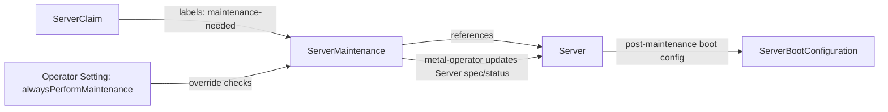
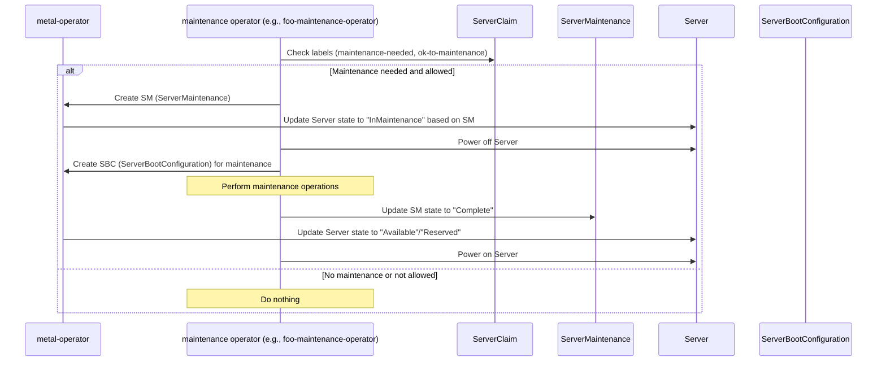

# ServerMaintenance

## Purpose
The `ServerMaintenance` resource represents a maintenance operation for a physical server. It transitions a `Server` from an operational state (e.g., Available/Reserved) into a Maintenance state. Each `ServerMaintenance` object tracks the lifecycle of a specific maintenance task, ensuring servers are properly taken offline, updated, and restored.

## Key Points
- A `ServerMaintenance` is namespaced and may be created for various maintenance types (e.g., BIOSUpdate, Cleanup).
- Only one `ServerMaintenance` can be actively assigned to a given `Server` at a time. Others remain pending.
- When the active `ServerMaintenance` completes, the next pending maintenance task (if any) becomes active.
- If no more maintenance tasks are pending, the `Server` transitions back to its previous operational state and is powered back on if required.
- The `ServerMaintenance` operator (part of the `metal-operator`) updates the `Server` spec/status based on the `ServerMaintenance`.
- Another operator (e.g., `foo-maintenance-operator`, `firmware-operator`, etc.) creates the `ServerMaintenance` resource and corresponding `ServerBootConfiguration`, and is responsible for powering servers on/off before and after maintenance.

## Workflow
1. **Triggering Maintenance:**
    - The specialized maintenance operator (e.g., `foo-maintenance-operator`) checks `ServerClaim` labels (e.g., `maintenance-needed: "true"`) and operator settings (`alwaysPerformMaintenance`).
    - If maintenance is needed and allowed, it creates a `ServerMaintenance` resource referencing the target `Server`.

2. **Maintenance States:**
    - **Pending:** The maintenance object is created but not yet active.
    - **InMaintenance:** The `Server` is taken offline and undergoing maintenance.
    - **Complete:** The maintenance task has finished successfully.

3. **Server Boot Configurations:**
    - The maintenance operator creates a `ServerBootConfiguration` associated with the `ServerMaintenance`.
    - During `InMaintenance`, the `Server` uses this configuration.
    - Once maintenance completes, the `Server` returns to its original or an updated configuration as needed.

4. **Post-Maintenance Transition:**
    - If another `ServerMaintenance` is pending, it becomes active next.
    - If no more maintenance tasks remain, the `Server` returns to `Available` or `Reserved` and is powered back on.

## Relationships Diagram



## Sequence Diagram

This shows interactions between the `metal-operator` and a hypothetical maintenance operator (e.g., `foo-maintenance-operator`):



## Example

```yaml
apiVersion: metal.ironcore.dev/v1alpha1
kind: ServerMaintenance
metadata:
  name: bios-update
  namespace: ops
spec:
  type: BIOSUpdate
  serverRef:
    name: server-foo
status:
  state: Pending
```

Once conditions are met (e.g., `ok-to-maintenance` is true or `alwaysPerformMaintenance` is enabled), the `Server` moves into `InMaintenance`. The maintenance operator powers the server off, applies the required boot configuration, performs the maintenance, marks `ServerMaintenance` as Complete, and finally powers the server back on. If multiple `ServerMaintenance` objects exist, the next pending one is processed next; otherwise, the `Server` returns to its previous operational state.